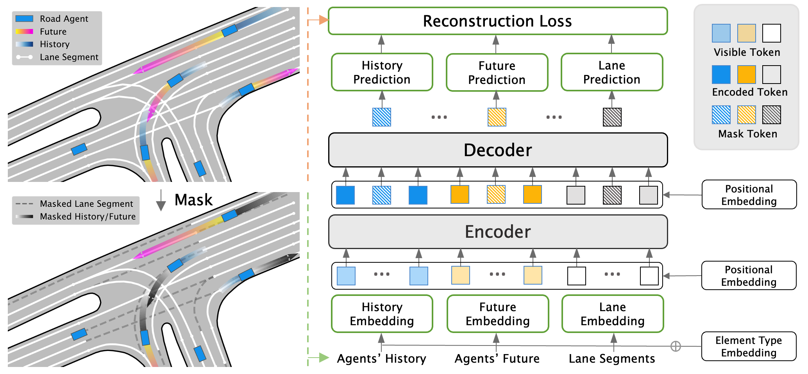

<br />
<p align="center">
  <h2 align="center">Forecast-MAE: Self-supervised Pre-training for Motion Forecasting with Masked Autoencoders</h1>
  <p align="center">
    <strong>Jie Cheng</strong><sup>1</sup>&nbsp;&nbsp;&nbsp;
    <strong>Xiaodong Mei</strong><sup>1</sup>&nbsp;&nbsp;&nbsp;
    <strong>Ming Liu</strong><sup>1,2</sup>&nbsp;&nbsp;&nbsp;
    <br />
    <strong>HKUST</strong><sup>1</sup>&nbsp;&nbsp;&nbsp; <strong>HKUST(GZ)</strong><sup>1,2</sup>&nbsp;&nbsp;&nbsp;
  </p>

  <p align="center">
    <a href="https://iccv2023.thecvf.com/">
    
    </a>
    <a href='https://arxiv.org/pdf/2308.09882.pdf' style='padding-left: 0.5rem;'>
      
    </a>
    <a href='https://hkustconnect-my.sharepoint.com/:b:/g/personal/jchengai_connect_ust_hk/ERCySXLweLFDgv7Ejouf-lgB1_cq4K1spcnS-bkSL2OxPA?e=DwINqh' style='padding-left: 0.5rem;'>
      
    </a>
  </p>

<p align="center">
  
</p>

## Highlight
- A neat yet effective MAE-based pre-training scheme for motion forecasting.
- A pretty simple forecasting model (basically pure transformer encoders) with relative good performance.
- This repo also provides a exemplary multi-agent motion forecasting baseline on Argoverse 2.0 dataset.

## Getting Started

- [Getting Started](#getting-started)
- [Setup Environment](#setup-environment)
- [Preprocess](#preprocess)
- [Training](#training)
- [Evaluation](#evaluation)
- [Results and checkpoints](#results-and-checkpoints)
- [Acknowledgements](#acknowledgements)
- [Citation](#citation)

## Setup Environment

1\. Clone this repository:

```
git clone https://github.com/jchengai/forecast-mae.git
cd forecast-mae
```

2\. Setup conda environment:

```
conda create -n forecast_mae python=3.8
conda activate forecast_mae
sh ./scripts/setup.sh
```

3\. Setup [Argoverse 2 Motion Forecasting Dataset](https://argoverse.github.io/user-guide/datasets/motion_forecasting.html#download), the expected data structure should be:

```
data_root
    ├── train
    │   ├── 0000b0f9-99f9-4a1f-a231-5be9e4c523f7
    │   ├── 0000b6ab-e100-4f6b-aee8-b520b57c0530
    │   ├── ...
    ├── val
    │   ├── 00010486-9a07-48ae-b493-cf4545855937
    │   ├── 00062a32-8d6d-4449-9948-6fedac67bfcd
    │   ├── ...
    ├── test
    │   ├── 0000b329-f890-4c2b-93f2-7e2413d4ca5b
    │   ├── 0008c251-e9b0-4708-b762-b15cb6effc27
    │   ├── ...
```

## Preprocess

(recommend) By default, we use [ray](https://github.com/ray-project/ray) and 16 cpu cores for preprocessing. It will take about 30 minutes to finish.

### Single-agent

```
python3 preprocess.py --data_root=/path/to/data_root -p
```

### Multi-agent

```
python3 preprocess.py --data_root=/path/to/data_root -m -p
```

or you can disable parallel preprocessing by removing `-p`.

## Training

- For single-card training, remove `gpus=4` in the following commands. `batch_size` refers to the batch size of each GPU.
- If you use [WandB](https://wandb.ai/site), you can enable wandb logging by adding option `wandb=online`.

### 1. Pre-training + fine-tuning (single-agent)

phase 1 - pre-training:

```
python3 train.py data_root=/path/to/data_root model=model_mae gpus=4 batch_size=32
```


phase 2 - fine-tuning:

(Note that quotes in `'pretrained_weights="/path/to/pretrain_ckpt"'` are necessary)

```
python3 train.py data_root=/path/to/data_root model=model_forecast gpus=4 batch_size=32 monitor=val_minFDE 'pretrained_weights="/path/to/pretrain_ckpt"'
```

### 2. Training from scratch (single-agent)

```
python3 train.py data_root=/path/to/data_root model=model_forecast gpus=4 batch_size=32 monitor=val_minFDE
```

### 3. Multi-agent motion forecasting

We also provide a simple multi-agent motion forecasting baseline using Forecast-MAE's backbone model.

```
python train.py data_root=/path/to/data_root model=model_forecast_mutliagent gpus=4 batch_size=32 monitor=val_AvgMinFDE
```

## Evaluation


### Single-agent

Evaluate on the validation set

```
python3 eval.py model=model_forecast data_root=/path/to/data_root batch_size=64 'checkpoint="/path/to/checkpoint"'
```

Generate submission file for the AV2 multi-agent motion forecasting benchmark

```
python3 eval.py model=model_forecast data_root=/path/to/data_root batch_size=64 'checkpoint="/path/to/checkpoint"' test=true
```

### Multi-agent

Evaluate on the validation set

```
python3 eval.py model=model_forecast_multiagent data_root=/path/to/data_root batch_size=64 'checkpoint="/path/to/checkpoint"'
```

Generate submission file for the AV2 multi-agent motion forecasting benchmark

```
python3 eval.py model=model_forecast_multiagent data_root=/path/to/data_root batch_size=64 'checkpoint="/path/to/checkpoint"' test=true
```

## Results and checkpoints

MAE-pretrained_weights: [download](https://hkustconnect-my.sharepoint.com/:u:/g/personal/jchengai_connect_ust_hk/EaE648yceoNEq0eg9J3gRpEBTbuwvjkK3msCUZqrZgBvpw?e=kZS2uK).

A visualization notebook of the mae reconstruction result can be found [here](./notebook/mae_reconstruction.ipynb).

For this repository, the expected performance on Argoverse 2 validation set is:

### Single-agent
| Models                                                                                                                                                            | minADE1 | minFDE1 | minADE6 | minFDE6 |  MR6  |
| :---------------------------------------------------------------------------------------------------------------------------------------------------------------- | :-----: | :-----: | :-----: | :-----: | :---: |
| [Forecast-MAE (scratch)](https://hkustconnect-my.sharepoint.com/:u:/g/personal/jchengai_connect_ust_hk/EfJc6E-mQsBEpoFhtg_5ioABuKQ86eU84BFNLx-JcFhDoQ?e=kNsruq)   |  1.802  |  4.529  | 0.7214  |  1.430  | 0.187 |
| [Forecast-MAE (fine-tune)](https://hkustconnect-my.sharepoint.com/:u:/g/personal/jchengai_connect_ust_hk/EYl6FKKGnM9Bux7cdJ756xwBsheZfoLJYZaUbJSV_5MZ2g?e=JtdTD0) |  1.744  |  4.376  | 0.7117  |  1.408  | 0.178 |

### Multi-agent

| Models                                                                                                                                                       | AvgMinADE6 | AvgMinFDE6 | ActorMR6 |
| ------------------------------------------------------------------------------------------------------------------------------------------------------------ | ---------- | ---------- | -------- |
| [Multiagent-Baseline](https://hkustconnect-my.sharepoint.com/:u:/g/personal/jchengai_connect_ust_hk/EajKZGZWtQFBhARC9CLGcIUBayB4Ij_X4QUipCf6fRk39A?e=E207gM) | 0.717      | 1.64       | 0.194    |


You can download the checkpoints with the corresponding link.

### Qualitative Results


## Acknowledgements

This repo benefits from [MAE](https://github.com/facebookresearch/mae), [Point-BERT](https://github.com/lulutang0608/Point-BERT), [Point-MAE](https://github.com/Pang-Yatian/Point-MAE), [NATTEN](https://github.com/SHI-Labs/NATTEN) and [HiVT](https://github.com/ZikangZhou/HiVT). Thanks for their great works.

## Citation

If you found this repository useful, please consider citing our work:

```bibtex
@article{cheng2023forecast,
  title={{Forecast-MAE}: Self-supervised Pre-training for Motion Forecasting with Masked Autoencoders},
  author={Cheng, Jie and Mei, Xiaodong and Liu, Ming},
  journal={Proceedings of the IEEE/CVF International Conference on Computer Vision},
  year={2023}
}
```
